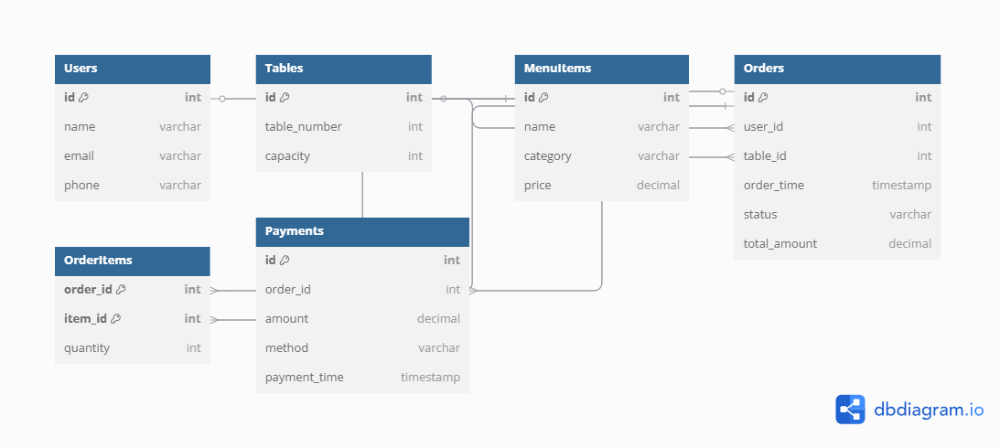

# Techathon_team-Zelda

### Quick Fixes

#### Q1: Essential System Features 
1. **Intuitive Menu Navigation**  
   - Large, clearly labeled categories and buttons to browse items, reducing confusion and speeding selection.   
2. **Secure Order Validation Before Submission**  
   - Smart pads perform a real-time inventory check before confirming the order. Customers are alerted if any items are unavailable, ensuring accurate and reliable ordering.

3. **Real-Time Order Tracking**  
   - Instant status updates (e.g. “Received,” “Preparing,” “Ready”) so customers and staff always know where each order stands. 

#### Q2: Design Principles for an Intuitive Interface 
1. **Simplicity & Clarity**  
   - Show only core actions on each screen. Use large icons/text and familiar button metaphors (e.g. “Next,” “Back”) so even tech novices know what to do.  
2. **Accessibility & Consistency**  
   - High-contrast text and simple language for all users. Keep button mapping uniform (Button 3 = forward, Button 4 = back) with instant visual/audio feedback.

#### Q3: Security Vulnerabilities & Solutions
1. **Device Theft/Tampering**  
   - *Risk:* Pad stolen or reset.  
   - *Fix:* Physically lock to table. track all pads connected to main server and it's condition.(if any pads becomes offline, generally notifies admin).  
2. **Unencrypted Communications**  
   - *Risk:* order tampering over Wi-Fi.  
   - *Fix:* Enforce WPA2/WPA3 Wi-Fi and HTTPS/TLS for all data transfers.  
3. **Weak Admin Access**  
   - *Risk:* Default or weak passwords on dashboard lead to data leaks.  
   - *Fix:* Enforce strong passwords/2FA and maintain audit logs of all admin actions.

#### Q4: Strategies for Responsiveness & Stability 
1. **Load Balancing & Auto-Scaling**  
   - Distribute traffic across multiple server instances behind a load balancer; auto-scale up during peak hours.  
2. **Caching & Query Optimization**  
   - Cache static data (menu, images) in Redis or CDN; index key database fields (order_time, table_id) and batch writes to reduce load.

#### Q5: Inventory System Integration 
- **Parallel-Run & API Sync**  
  1. Keep the old inventory system live while you build the new one.  
  2. Implement a sync service that reads stock changes via the existing API or DB and updates the new system in real time.  
  3. Run both systems side-by-side, verify data consistency, then cut over orders to the new system once fully synced.


## Tech Tricks

### Q1: Database Schema Design

**Goal:** Track users, orders, menu items, tables, and payments; optimized for fast queries.

#### Entity Definitions

1. **Users**  
   - `id` (PK, INT, auto-increment)  
   - `name` (VARCHAR)  
   - `email` (VARCHAR, UNIQUE, indexed)  
   - `phone` (VARCHAR)

2. **Tables**  
   - `id` (PK, INT, auto-increment)  
   - `table_number` (INT, UNIQUE, indexed)  
   - `capacity` (INT)

3. **MenuItems**  
   - `id` (PK, INT, auto-increment)  
   - `name` (VARCHAR)  
   - `category` (VARCHAR, indexed)  
   - `price` (DECIMAL)

4. **Orders**  
   - `id` (PK, INT, auto-increment)  
   - `user_id` (FK → Users.id, indexed)  
   - `table_id` (FK → Tables.id, indexed)  
   - `order_time` (TIMESTAMP, indexed)  
   - `status` (ENUM: received, preparing, ready, served)  
   - `total_amount` (DECIMAL)

5. **OrderItems**  
   - `order_id` (FK → Orders.id, indexed)  
   - `item_id` (FK → MenuItems.id, indexed)  
   - `quantity` (INT)  
   - **Composite PK:** (`order_id`, `item_id`)

6. **Payments**  
   - `id` (PK, INT, auto-increment)  
   - `order_id` (FK → Orders.id, indexed)  
   - `amount` (DECIMAL)  
   - `method` (ENUM: cash, card, mobile)  
   - `payment_time` (TIMESTAMP)

#### Indexes & Optimization
- Index on `Orders(order_time)` for fast time-based queries.
- Index on `Users(email)` to quickly look up customer records.
- Composite index on `OrderItems(order_id, item_id)` to speed up joins.
- Consider sharding or partitioning `Orders` by month if volume is very high.

 


### Q2: SQL Query for Orders in the Last Hour 

**Task:** Retrieve table number, ordered items, and order time for all orders placed in the last hour, optimized for speed.

#### Assumptions
- Table name for orders: `Orders`
- Table for order items: `OrderItems`
- Table for menu items: `MenuItems`
- `Orders.table_id` links to `Tables.id`
- `OrderItems.order_id` links to `Orders.id`
- `OrderItems.item_id` links to `MenuItems.id`
- `Tables.table_number` is the visible table number.

#### SQL Query

```sql
SELECT 
  t.table_number,
  m.name AS item_name,
  o.order_time
FROM 
  Orders o
JOIN 
  OrderItems oi ON o.id = oi.order_id
JOIN 
  MenuItems m ON oi.item_id = m.id
JOIN
  Tables t ON o.table_id = t.id
WHERE 
  o.order_time >= NOW() - INTERVAL 1 HOUR
ORDER BY 
  o.order_time DESC;
```

### Q3: Real-Time Notification to Kitchen Staff (90 pts)

**Objective:**  
Notify the kitchen immediately when a new order is placed.

#### Solution Approach

✅ **Technology Stack:**
- **Backend Server:** Node.js (Express.js) or Python (Flask/FastAPI)
- **Real-Time Messaging:** WebSockets (Socket.IO for Node.js)
- **Frontend Kitchen Dashboard:** Simple HTML + JavaScript or React.js app
- **Database:** MySQL (or any relational DB)

✅ **How it Works:**
1. **Order Placement:**
   - When a customer submits an order on the smart pad, the order is sent to the backend API.
   
2. **Backend Broadcast:**
   - After successfully saving the order into the database, the server emits a WebSocket event (`newOrder`) containing order details (table number, items, time).

3. **Kitchen Dashboard:**
   - The kitchen’s web dashboard (open in a browser) listens for the `newOrder` event in real-time.
   - New orders instantly appear on the screen without refreshing.

**System Flow Diagram:**

Customer (Smart Pad) ---> [HTTP POST] ---> Server (Backend API) | | emits "newOrder" event ↓ Kitchen Dashboard (WebSocket Client)


**Example Technologies:**
- **Server:** Node.js + Express + Socket.IO
- **Dashboard:** HTML/CSS/JS + Socket.IO-client
- **Optional:** Add a small "New Order Sound" on dashboard when new order arrives (for better attention).

---

**Justification:**
- **WebSocket** technology provides **instant two-way communication** without requiring the kitchen to refresh manually.
- **Socket.IO** makes it easy for beginners to implement real-time features.

---


### Q4: Cloud-Based System Architecture 

**Objective:**  
Describe a cloud system that handles real-time updates, stores data, and allows smart pads to communicate efficiently with low latency and high availability.

---

✅ **High-Level Components:**

1. **Frontend (Smart Pad Interface):**
   - Smart pads send order data via HTTP POST or WebSocket.

2. **Load Balancer:**
   - Distributes incoming smart pad traffic evenly across multiple backend servers.
   - Example: AWS Elastic Load Balancer.

3. **Backend API Servers (Compute Layer):**
   - Stateless application servers (Node.js, Python, etc.) handle incoming orders and push real-time updates.
   - Auto-scaled based on load.
   - Example: AWS EC2 Auto Scaling Group or AWS ECS (Docker containers).

4. **Real-Time Messaging Layer:**
   - WebSocket or Server-Sent Events (SSE) server (e.g., Socket.IO backend) to push real-time order updates to kitchen dashboards.
   - Optionally use a managed service like AWS AppSync or Firebase Realtime Database.

5. **Database Layer:**
   - Managed relational database for storing users, tables, menu items, orders, and payments.
   - Example: AWS RDS (MySQL or PostgreSQL) with Multi-AZ replication for high availability.

6. **Cache Layer:**
   - In-memory caching of menus, common queries using Redis or AWS ElastiCache to minimize database load and improve response speed.

7. **Object Storage:**
   - Store media files (e.g., menu images) in a cloud storage service like AWS S3.
   - Serve via CDN (AWS CloudFront) to reduce latency.

8. **Monitoring and Alerting:**
   - Monitor system health, traffic spikes, and database performance.
   - Tools: AWS CloudWatch, Datadog, or Grafana.

---

**Architecture Diagram (Text Description):**

Smart Pads --> Load Balancer --> Backend API Servers --> --> Database (Orders, Users) --> WebSocket Server (Real-Time Updates) --> Cache (Redis) --> Storage (S3 for Media) --> Monitoring & Alerts


---

**Key Strategies for Low Latency & High Availability:**
- Auto-scaling servers based on CPU/network load.
- Multi-AZ (availability zones) database replication.
- Redis caching for frequent reads (e.g., menu).
- WebSocket real-time communication instead of polling.
- CDN (Content Delivery Network) for fast menu/media loading.
- Health checks and automatic failover if a server/database goes down.

---

**Justification:**
- This layered cloud architecture ensures Bistro 92 can scale during dinner rushes without lagging, dropping orders, or crashing.
- Using managed services (AWS/Firebase) keeps the system simple and beginner-friendly while remaining production-grade.

---


### Q5: Real-Time Dashboard for Pending Orders, Average Fulfillment Time, and Total Sales 

**Objective:**  
Design a dashboard to display pending orders, average order fulfillment time, and total sales — updated in real-time.

---

**Dashboard Features:**
- **Pending Orders Counter:** Shows the number of orders not yet served.
- **Average Fulfillment Time:** Calculates the average time taken to fulfill orders (from placement to ready/served).
- **Total Sales:** Sum of all payments made today (or selectable by date).

---

**Technology Stack:**

- **Backend API Server:** Node.js/Express or Python/FastAPI
- **Database:** MySQL or PostgreSQL (same as used earlier)
- **Real-Time Updates:** WebSockets (using Socket.IO)  
  → Server emits real-time updates on new orders, order status changes, or payments.
- **Dashboard Frontend:** React.js (preferred) or simple HTML/CSS/JS with Chart.js for charts.
- **Optional Tools:** 
  - **Grafana + InfluxDB** if you want a quick pre-built dashboard (Grafana can auto-update graphs live).
  - **Redis** for caching sales data and quick metrics.

---

**How it Works:**

1. **Pending Orders:**
   - Listen for new orders via WebSocket.
   - Increment the pending counter when a new order arrives.
   - Decrement when an order is marked "ready" or "served".

2. **Average Fulfillment Time:**
   - Each time an order is completed, calculate `(completed_time - order_time)`.
   - Maintain a running average on the server or fetch it periodically.

3. **Total Sales:**
   - Every time a payment is completed, increment today's total sales amount.
   - Could cache sales for the current day in Redis for instant access.

---


**Visualization Tools:**
- **Numbers and Gauges:** Use large counters or circular gauges for Pending Orders and Sales.
- **Live Table/List:** Display all pending or active orders in a scrolling list.

---

**Key Performance Strategies:**
- Use **WebSocket events** to push live updates (instead of polling every few seconds).
- Cache today's total sales in **Redis** (optional) to reduce DB reads.
- Render only visible orders; paginate or scroll to avoid slowing down on large data.
- Auto-refresh counters smoothly with transitions for better UX.

---

**Justification:**
- A simple but efficient real-time dashboard will make it easier for managers and kitchen staff to monitor operations at a glance, improving service speed and customer satisfaction.

---


## Device to API Communication (ESP32 Smart Pad) ##

**Overview**

The ESP32 acts as a smart order device (Smart Pad) that:

- Connects to Wi-Fi

- Lets customers select their food items

- Sends the selected order dynamically to the Django-based backend API over HTTPS.

**API Endpoint**

- URL: https://your-domain-name.com/api/orders/

- Method: POST

- Content-Type: application/json

JSON Payload Format Sent from ESP32

```
{
  "table_number": 5,
  "items": [
    { "item_id": 1, "quantity": 2 },
    { "item_id": 3, "quantity": 1 }
  ]
}
```

- table_number: The customer's table number.

- items: List of selected menu items with their corresponding quantities.


**Security Considerations**

- HTTPS is used to encrypt communication.

- SSL Certificate validation can be implemented on the ESP32 (currently setInsecure for quick development).

- Future improvements: Token authentication can be added to prevent unauthorized devices.

Expected API Response

On successful order placement:
```
{
  "order_id": 17,
  "status": "Order placed successfully",
  "estimated_time": "15 minutes"
}
```
```
201 HTTP Created status code is returned.
```

Server also responds with the new Order ID and estimated fulfillment time.

